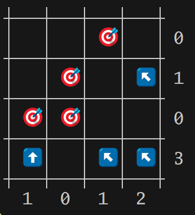

# targets-solver - targets puzzle solver

The Sunday New York Times magazine frequently has a puzzle at the back of the
magazine called "targets".  A matrix is printed, with small "target" icons
in some matrix cells, and the rows and columns have a number associated
with them.  The puzzle solver is supposed to write in "arrows", pointing
N, NE, E, SE, S, SW, W, or NW in empty cells, each pointing to a target,
such that the numbers associated with rows and columns end up counting the
number of arrows in those rows and columns.

Eg, on the left is the puzzle, on the right is the solution.

```
┼───┼───┼───┼───┼            ┼───┼───┼───┼───┼
│   │   │ O │   │ 0          │   │   │ O │   │ 0
┼───┼───┼───┼───┼            ┼───┼───┼───┼───┼
│   │ O │   │   │ 1          │   │ O │   │ \ │ 1
┼───┼───┼───┼───┼            ┼───┼───┼───┼───┼
│ O │ O │   │   │ 0          │ O │ O │   │   │ 0
┼───┼───┼───┼───┼            ┼───┼───┼───┼───┼
│   │   │   │   │ 3          │ | │   │ \ │ \ │ 3
┼───┼───┼───┼───┼            ┼───┼───┼───┼───┼
  1   0   1   2                1   0   1   2  

```

The "pure ascii" version doesn't show the arrow heads, you can figure them by
context though ... usually.

The emoji version looks a little nicer:



This project implements a targets solver.

To run it, you'll enter

- the numbers associated with the rows, prefixed by `r:`
- the numbers associated with the columns, prefixed by `c:`
- the x,y coordinates of the targets (1,1 based), prefixed by `t:`

Eg, to solve the puzzle above, the arguments would be:

```
targets-solver r: 0 1 0 3   c: 1 0 1 2   t: 3,1 2,2 1,3 2,3
```

Here's are some bigger ones to solve:

```
targets-solver r: 4 2 0 1 1 3  c: 0 2 2 1 2 4  t: 1,1 1,2 4,2 1,3 2,3 5,3 1,4 2,4 4,5 1,6 4,6
```

```
targets-solver r: 3 2 2 2 1 1  c: 3 1 0 1 1 5  t: 3,2 3,3 4,3 2,4 3,4 2,5 3,5 4,5 3,6 4,6 5,6
```

```
targets-solver r: 4 2 2 2 1 2  c: 1 2 3 3 3 1  t: 1,1 3,2 4,2 2,3 5,3 6,3 1,4 6,4 2,5 5,5 1,6 2,6 6,6
```

# install

```console
$ npm install -g pmuellr/targets-solver
```

# license

This package is licensed under the MIT license.  See the
[LICENSE.md](LICENSE.md) file for more information.


# contributing

Awesome!  We're happy that you want to contribute.

Please read the [CONTRIBUTING.md](CONTRIBUTING.md) file for more information.
